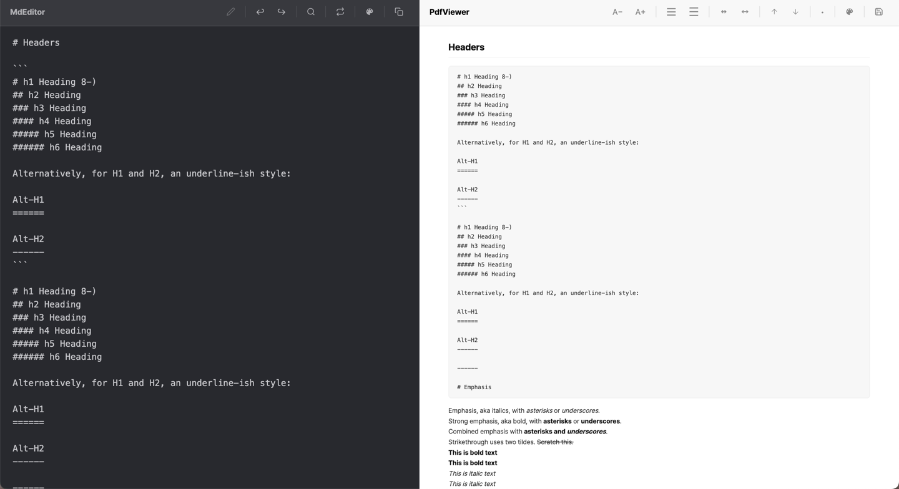
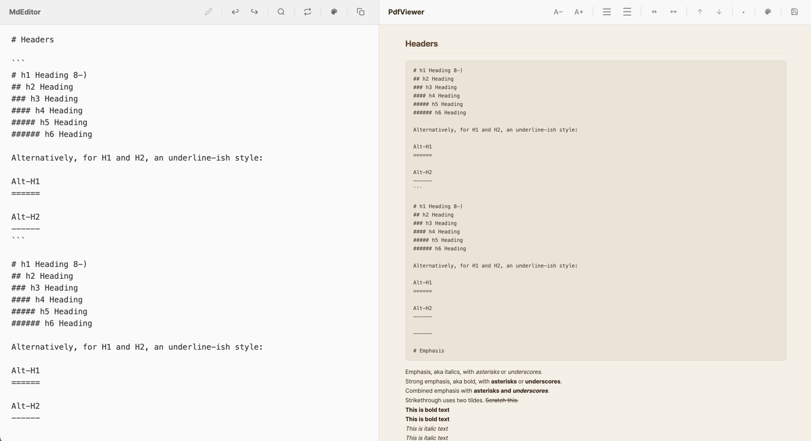
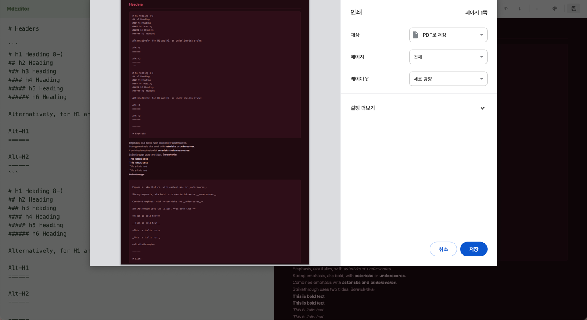

# MdNote

Markdown editor with real-time preview.

[mdnote.ecsimsw.com](https://mdnote.ecsimsw.com)

## Features

- Split-pane editor & preview
- 12 themes (editor / preview independent)
- Font size, line height, width, top padding controls
- Find & Replace
- Markdown toolbar (H1~H3, Bold, Italic, Code, Link, Image...)
- List style options
- PDF export with theme support
- Undo / Redo
- Settings saved in browser (localStorage)

## Screenshot

## License

MIT
