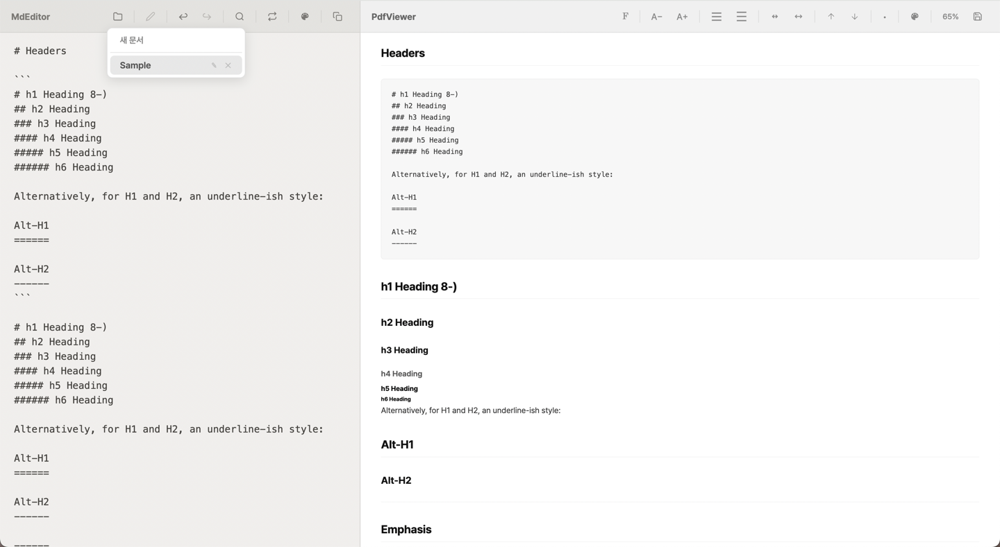
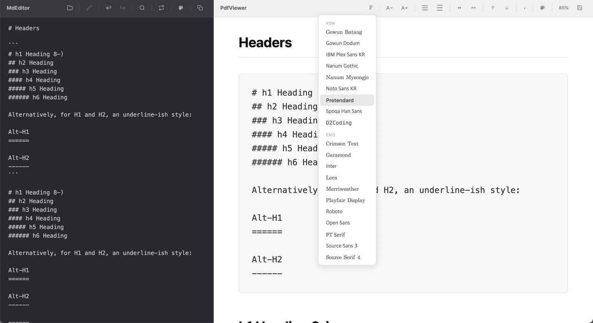
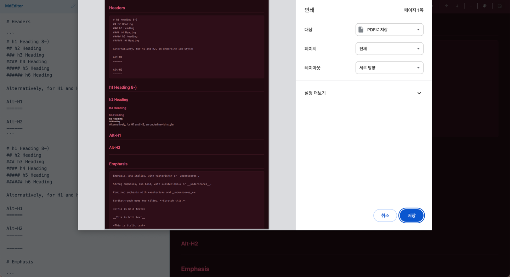

# MdNote

Markdown editor with real-time preview.

[mdnote.ecsimsw.com](https://mdnote.ecsimsw.com)

## Features

- Split-pane editor & preview
- Document management (up to 20 docs, auto-save)
- Cloud storage — GitHub repo & AWS S3 bucket integration
  - Browse, create, rename, delete remote .md files
  - Commit & push to GitHub, upload to S3
  - Encrypted token storage (AES-256-GCM)
- 12 themes (editor / preview independent)
- 20+ fonts, font size, line height, width, top padding controls
- Find & Replace
- Markdown toolbar (H1~H3, Bold, Italic, Code, Link, Image...)
- Image drag & drop, paste, resize, alignment, nudge
- List style options (10 types including custom)
- PDF export with adjustable zoom
- Undo / Redo
- Folder-based file organization (local & remote)
- Horizontal scroll for wide content
- Settings saved in browser (localStorage)

## Screenshot

## License

MIT
